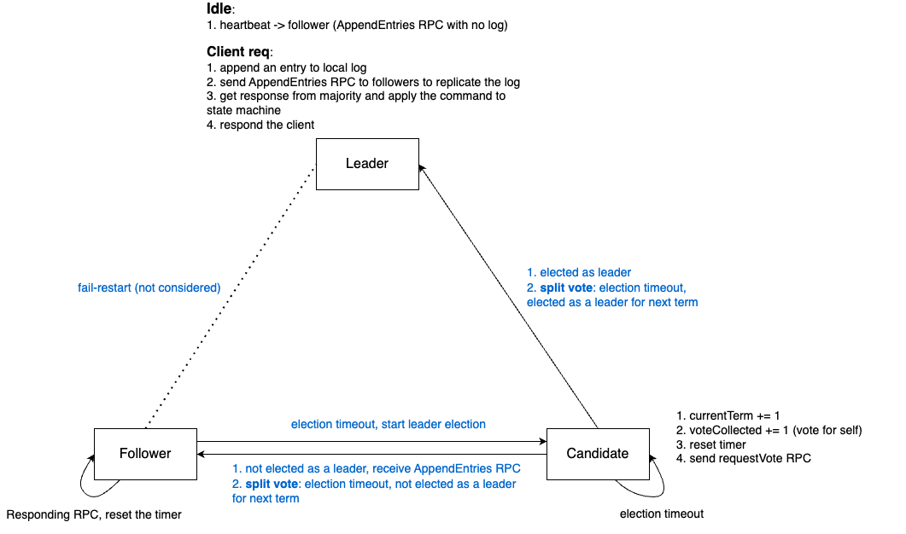

# MP2-ECE428 Leader Election and Log Consensus with Raft

## Raft - state transfer diagram


## design

### timer

```go
type Timer struct {
    time       int 
    timeoutVal int 
}

func (tmr *Timer) increment() {}

func (tmr *Timer) isTimeOut() {}

func (tmr *Timer) reset() {}
```
Each raft peer holds a Timer object. When there's no incoming RPCs, the Timer.time field repeatedly increments until there's a RPC that can interrupt this process. 